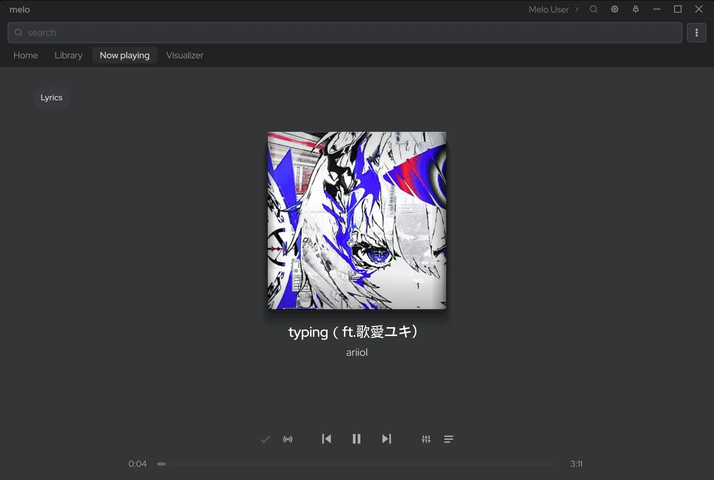
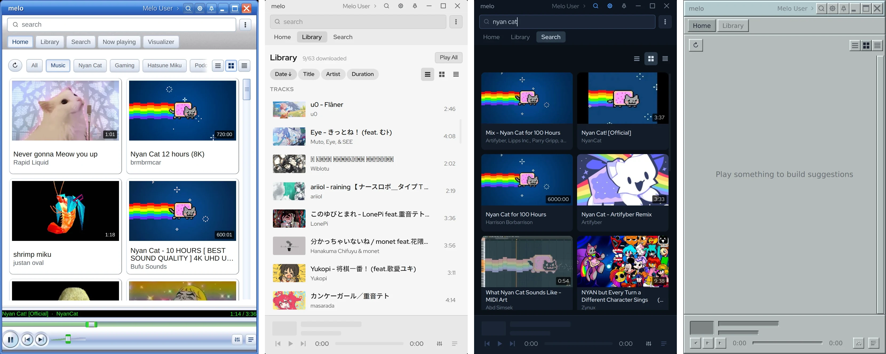

<h1 align="center">
  <picture>
    <source media="(prefers-color-scheme: dark)" srcset="resources/melo-lockup-white.svg">
    
  </picture>
</h1>

<p align="center">A YouTube integrated native desktop music player.</p>

<p align="center">
  <a href="https://github.com/melo-foundation/melo/releases/latest">Download</a> ·
  <a href="https://github.com/melo-foundation/melo/issues/new?template=bug_report.yml">Report a bug</a> ·
  <a href="https://github.com/melo-foundation/melo/issues/new?template=feature_request.yml">Request a feature</a> ·
  <a href="docs/plugins.md">Write a plugin</a> ·
  <a href="https://discord.gg/T2jHMX6AcG">Discord</a>
</p>

> [!NOTE]
> melo is in alpha.

<p align="center">
  
</p>
<p align="center">
  
</p>

## Features

- YouTube and YouTube Music search, home feed, mixes and radio
- Switch between the YouTube accounts in your browsers and any number of guest profiles, each with its own recommendations
- Crossfade, gapless playback and silence skipping
- Library and playlists, with offline downloads and local file import
- Automatic tagging from MusicBrainz, Deezer and Last.fm
- Time-synced lyrics that follow the song line by line
- 10-band equaliser and MilkDrop visualiser
- 16 built-in themes and a theme editor that restyles every control, layers dozens of effects and reshapes the window
- Fully customisable player bar layout
- Mini player: a compact window with its own layout, and a pop-out queue and visualiser
- Custom keyboard shortcuts
- Media keys and MPRIS support
- Extensive plugin system for new music sources, player bar buttons, custom windows and more

## Download

**[Latest alpha](https://github.com/melo-foundation/melo/releases/latest)**: tested before release. Linux only for now: AppImage, `.deb`, `.rpm` and Arch package.

**[Nightly](https://github.com/melo-foundation/melo/releases/tag/nightly)**: built daily from the newest commit and not tested.

## Build from source

Requires Qt 6.5 or newer with Qt Shader Tools, GStreamer 1.0 with the base,
good and bad plugins, GLEW, Wayland client headers, fontconfig, curl, git,
Node.js and pnpm.

Fedora 43 and newer:

```
sudo dnf install qt6-qtbase-devel qt6-qtbase-private-devel \
  qt6-qtdeclarative-devel qt6-qttools-devel qt6-qt5compat-devel \
  qt6-qtshadertools-devel gstreamer1-devel gstreamer1-plugins-base-devel \
  gstreamer1-plugins-good gstreamer1-plugins-bad-free glew-devel \
  wayland-devel fontconfig-devel cmake gcc-c++ git nodejs
sudo npm install -g pnpm
```

Debian 13 or Ubuntu 26.04, and newer:

```
sudo apt install qt6-base-dev qt6-base-private-dev qt6-declarative-dev \
  qt6-declarative-private-dev qt6-declarative-dev-tools qt6-tools-dev \
  qt6-shadertools-dev qml6-module-qt5compat-graphicaleffects \
  qml6-module-qtquick qml6-module-qtquick-window qml6-module-qtquick-layouts \
  qml6-module-qtquick-shapes qml6-module-qtquick-controls \
  libgstreamer1.0-dev libgstreamer-plugins-base1.0-dev \
  gstreamer1.0-plugins-base gstreamer1.0-plugins-good gstreamer1.0-plugins-bad \
  libglew-dev libwayland-dev libfontconfig-dev libgl1-mesa-dev \
  cmake g++ git curl nodejs npm
sudo npm install -g pnpm
```

Then:

```
git clone https://github.com/melo-foundation/melo.git
cd melo
cmake -B build
cmake --build build -j"$(nproc)"
./build/melo
```

The first `cmake -B build` downloads and builds melo's bundled dependencies,
which takes a few minutes.

To install it system-wide:

```
sudo cmake --install build --prefix /usr/local
```

## TODO

- [ ] Subscriptions page
- [ ] Channel pages
- [ ] Reworked theme creation and appearance settings
- [ ] Improved and extended layout editor
- [ ] Plugin and theme store
- [ ] Improved auto-tagging
- [ ] Accessibility: screen reader support and keyboard navigation
- [ ] Translations
- [ ] Windows and macOS releases
- [ ] Video playback in Now Playing

## Reporting bugs and requesting features

Use the forms on the [Issues page](https://github.com/melo-foundation/melo/issues/new/choose). Search existing issues first; if yours is already there, add to it.

Report security problems privately, as described in [SECURITY.md](SECURITY.md).

To contribute code, see [CONTRIBUTING.md](CONTRIBUTING.md).

## Donate

So far melo is the work of one person's free time over the past year. If you're enjoying it donations help keep that work going.

BTC
```
bc1qzpwsr4mkhq0pm0dnntnnta0asrjwnrezt0mvt9
```
ETH
```
0x2c283673287396bBAAc8c471276Ab1673DF9074B
```
SOL
```
EnRisDAKEgp9Sa7iJxfjG2KdSojCp32Up7DmEtXrMVRb
```
XMR
```
86nuvmwbjd8697NcqdGVYy1wH8gpE7eXwRTYbpd6y6jzFgQTufgnxuJeTCN95uucH5VgRxupTp2XxWDm2UwkG26HRv3tnYD
```

## Licence

GPL-3.0-or-later. See `LICENSE`.

Bundled and linked components and their terms: `THIRD-PARTY.md`.
